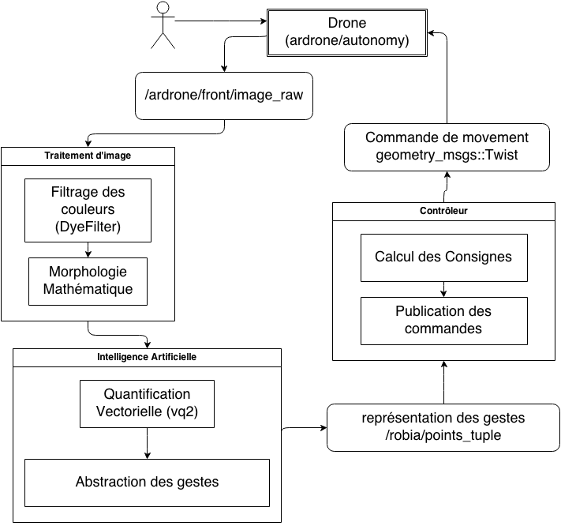

# Gesture control for drone with onboard camera 
-----------

a gesture control project for Parrot's ARDrone developed by first-year students at Supélec, MALIS Lab.

## Overall Architecture

## Dependencies
* The project includes the source code of `ardrone_autonomy` which should be able to compile with `catkin_make`. 
* The project is built upon `ros-hydro` and compile with `catkin_make`. More explanation and tutorial can be found [here](http://wiki.ros.org/ROS/Tutorials). Choose `catkin` and `hydro` when asked.
* The project makes use of gngt whose implementation is based on `robia/vq2-1.33` and adapted in `ros/catkin_ws/src/robia/AI.h and .cpp`. Details of the algorithms and how to compile from source can be found [here](http://malis.metz.supelec.fr/spip.php?article182). This implementation is developped by [M.Frezza-Buet Herve](http://www.metz.supelec.fr/metz/personnel/frezza/) at Supélec Metz.
* The project depends on dye color filter, whose source is avaiable [here](http://malis.metz.supelec.fr/spip.php?rubrique21). A port to OpenCV is avaiable at `robia/tracker`. `tracker` is a standalone application that can be run with standard opencv compilation flags, a makefile is avaiable in `robia/tracker` as well. 

## Usage
The source-code developped for this project is available in robia/ros. Other subdirectories are libraries projects that we have used in our project. 

You can clone the whole repository to use it.

	git clone https://github.com/liusiqi43/robia.git
	
Once cloned and properly configured, you need to run 

	catkin_make
	
to compile and

	roslaunch robia ros.launch
	
to run. 

This assumes that you are connected to the ParrotAR drone via wifi successfully. Multiples nodes would be launched: 

	<launch>
		<node name="ardrone_driver" pkg="ardrone_autonomy" type="ardrone_driver" output="screen"/>
		<node name="keyboard_cmd" pkg="robia" type="keyboard_cmd" output="screen"/>
		<node name="AI" pkg="robia" type="AI" output="screen"/>
		<node name="Control" pkg="robia" type="Control" output="screen"/>
		<node name="image_view" pkg="image_view" type="image_view">
			<remap from="image" to="/robia/gngt_output"/>
		</node>
	</launch>
	

1. **ardrone_driver** is based on open-source project avaiable [here](https://github.com/AutonomyLab/ardrone_autonomy). It's the bridge between drone and other components in the program. 
2. **keyboard_cmd** is developped for control over keyboard
3. **AI** includes image processing (color filter, denoising using erosion and dilatation) as well as vectorial quantification (gngt). The output of this node is a gesture representation. 
4. **Control** reacts to different gesture and send commands back to drone. 
5. **image_view** is a real-time visualiser of the drone's vision and the result of calculation done by AI node.

## Demo
A video demo of our first attemps is available [here](https://www.youtube.com/watch?v=uqZO2VXokQA). 